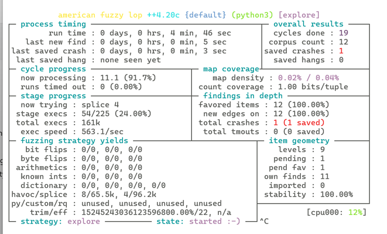

# A Basic Guide to Fuzzing with AFL++ Unicorn Mode

## Getting Started with Fuzzing FreeRTOS Firmware
Fuzzing is an essential technique in finding vulnerabilities in software by providing invalid, unexpected data inputs to the targeted application. In this blog post, we will demonstrate how to fuzz a function from a Raspberry Pi Pico-W FreeRTOS firmware using AFL++ Unicorn mode. The firmware analyzed in this post is available on GitHub. The firmware contains a crackme built on top of the Raspberry Pi pico-examples Pico W example for FreeRTOS with httpd. I added a CGI handler for `/fuzzy.cgi` which base64 decodes a URL parameter (data) and passes it to a function `process_payload`.

The supplied ELF is complete with debug symbols to keep the focus of this post on fuzzing rather than reversing. You can find the example firmware and final fuzzing script on GitHub: https://github.com/cy1337/basic_afl_unicorn

## Introduction to AFL++ Unicorn Mode
AFL++ Unicorn mode allows you to fuzz using Unicorn CPU emulation to instrument bare metal or RTOS applications running on a variety of platforms. It's also lightweight enough that you can still get enough execs/sec to reasonably find bugs. This mode has come in handy for me on a few audits where traditional fuzzing approaches were not directly feasible due to either lack of source code or lack of tooling for a specific CPU architecture.

## Identifying a Target
When looking for fuzz targets in an RTOS, we want to find functions that are relatively isolated. Things which take in some data and process it without switching contexts or making system calls are best. If you attend one of my classes, we'll walk through how to handle these situations techniques for tracing tainted inputs and execution flow to help select targets. For the sake of this blog however, we are starting from the point where an optimal candidate for fuzzing has already been identified. Specifically, the fuzz target here is called `process_payload` and it takes a pointer to a buffer along with the data length making it ideal for AFL++. In this script, we will simply read the symbol table to find the start of the function. We'll also need to tell Unicorn where to stop. In this case, we'll simply scan the file looking for the first bx lr instruction after the function offset. The Cortex-M using this instruction to return from a function to the function which called it. (The return address is commonly stored in the `lr` register for basic function calls.) This work is handled by functions `get_function_address` and `find_bx_lr_address` in the finished script. I won't get into this in detail here but feel free to review the code and reach out to me if you have any questions.

## Preparing for Emulation
In order to fuzz with AFL++ Unicorn mode, we must next create a Unicorn script to load the supplied firmware and setup an emulated CPU to run through the fuzzed code. This requires defining, configuring, and loading CPU memory and registers. To begin, we must create an instance for Unicorn emulation of ARM in Thumb mode.
```python
uc = Uc(UC_ARCH_ARM, UC_MODE_THUMB)
uc.hook_add(UC_HOOK_CODE, hook_code)
```
The script also creates a hook for getting called on each executed instruction. Having the ability to enable a debug mode for instruction tracing comes in handy when debugging and this leaves us open to easily mark bad instructions or interesting states. (A bad instruction in this case is anything Unicorn can't emulate such as some CPU privilege switches used in RTOS code.) Since we are working with an ELF, the script here will use header information to arrange the binary segments into aligned memory mappings. Depending on your scenario, you may need to load this from debug memory dumps. My preferred approach is to attach GDB to a target with a breakpoint to generate a core dump. The resulting dump can be used similarly to the firmware ELF to establish an emulated CPU for fuzzing. Ghidra can also give clues in it's memory map to help you figure out how to arrange content in memory for a fuzz.

The logic for mapping memory regions and copying in content is contained in load_elf_segments. This function iterates over the ELF segments mapping each with the permissions expressed in the header by calling mem_map on the unicorn object. The most important thing to remember at this stage is to keep the memory mappings aligned to page boundaries. This is done by zeroing out the lower bits of an address to land on a block boundary at aligned_vaddr. Next the required mapping size is computed by filling out the rest of the block and then using integer division to count how many pages are needed. We also must map some additional ranges for a program stack as well as for storing the input testcases.

```python
    load_elf_segments(uc, BINARY_PATH)
    uc.mem_map(STACK_ADDR, STACK_SIZE, UC_PROT_READ | UC_PROT_WRITE)
    uc.mem_map(INPUT_ADDR, INPUT_SIZE, UC_PROT_READ | UC_PROT_WRITE)
```

## Placing Fuzzed Inputs
Now that the firmware has been loaded into memory with roughly the correct mappings, the next thing we need to do is create a function that will load some test input into memory and set the CPU registers accordingly to execute the fuzz target. At this point, it is important to consider the calling convention of the targeted function. In the case of Pico-W, this is an ARM Cortex-9 and so process_payload will receive parameters via registers `r0` and `r1` as shown when exploring the firmware in Ghidra:


ARM is also interesting because the LSB of `pc` indicates whether the CPU will expect ARM vs Thumb instructions. For this Pico-W example, we will set the LSB and thus configure Thumb mode which is typical for Cortex-M and is indicated in the Ghidra listing above as TMode.

In summary, place_input will write testcase data into the previously mapped memory using `mem_write`. The address with the input data is written into register `r0` and the input length is written into `r1` using `reg_write`. `sp` is set to an appropriate address at the top of the stack. (The stack will grow downward and requires a 16-byte alignment.) `pc` is set based on the symbol we located earlier keeping in mind to set the LSB for Thumb mode (e.g. `addr | 1`).

```python
def place_input(uc, input_data, _index, _data):
    debug("Injecting input (%d bytes)", len(input_data))
    uc.mem_write(INPUT_ADDR, input_data)
    uc.reg_write(UC_ARM_REG_R0, INPUT_ADDR)
    uc.reg_write(UC_ARM_REG_R1, len(input_data))
    uc.reg_write(UC_ARM_REG_SP, STACK_ADDR + STACK_SIZE - 0x10)
    uc.reg_write(UC_ARM_REG_PC, target_func_addr | 1)
    return True
```

## Running the Fuzz
The last piece we need in our script is to call uc_afl_fuzz with our initialized emulator, testcase filename, place_inputs for callback, and a list of addresses where the emulation should stop.
```python
exits = [return_addr]

    logging.info("Starting AFL loop starting @ 0x%08x with exit @ 0x%08x", target_func_addr, return_addr)
    unicornafl.uc_afl_fuzz(
        uc,
        afl_input,
        place_input,
        exits
    )
```
With that in place, we can start the AFL++ fuzzing campaign using something like:
```bash
afl-fuzz -U -i in -o out -G 4096 -- python3 pico_w_fuzz_example.py @@
```
I seeded my fuzz with a single byte testcase (e.g. `echo -ne A > in/1`) and AFL++ Unicorn mode went to work discovering paths. Note that I've included '-G 4096' as an AFL parameter. This sets a maximum size on the testcases AFL will test and corresponds to how much memory we mapped in the emulator. Experimenting with smaller sizes may improve performance of the fuzz. This specific example is a simple set of if statements which perform single byte checks on the input. If the input matches a secret key it will cause a null pointer dereference. Each time AFL++ adds an input to the corpus, it means that it has identified another byte from the secret input. On my not-so-fancy laptop, it took about 5 minutes to recover the secret passphrase which causes this firmware to crash.


You can run the supplied firmware on a Pico W to see this in action. After loading the ELF onto a device, it will wait for a USB serial connection (115200 baud) before starting FreeRTOS and connecting to a wifi network with SSID 'DemoNet' and PSK 'Password123!'. The IP address will be printed on the serial console if the connection succeeds. You can then send testcases to the target function using curl (substituting your IP and the secret value found by fuzzing):
```bash
curl -v http://ip/fuzzy.cgi?data=$(echo -ne secret | base64 -w0)
```

## Further Work
As the title implies, this post is only a starting point for fuzzing embedded systems with AFL++ Unicorn mode. This example was carefully crafted to provide the most direct path to fuzzing possible. This does work for real-world targets but in my experience, interesting targets are often not so clean like this one and the basic framework will miss some interesting bugs as well. Often times interesting functionality will have more detailed requirements or depend on hardware behavior that is not easily emulated in Unicorn. For example, functions dealing with more complicated input data structures or those which make use of RTOS APIs require a little more consideration. This is common with something like a logging function which wants to output to a UART or certain OS or hardware calls. There are a few tricks for doing this. My preferred techniques are two either patch in return instructions (e.g. bx lr) for known bad functions when loading the firmware or to create a list of hook addresses to skip while fuzzing. For some things it will be necessary to simulate behavior with Python code. Addresses to skip can be processed in the hook currently used to make a debug execution trace.

Another issue is crash detection. This toy example makes a blatant null pointer dereference but from a security perspective these are not always the most impactful or interesting bugs. On other platforms we can turn to something like QASAN, libdislocate.so, or valgrind to shake out more bugs but I'm not aware of anything like that which can be applied to an embedded firmware in this scenario. Fortunately it isn't terribly difficult to implement a quick and dirty checked heap. This is achieved by hooking memory allocators like malloc and tracking memory allocations in Python lists. Memory access hooks are then used to detect out-of-bounds memory access and trigger crashes for AFL++ to collect.

## Upcoming Class
This repo contains an introduction to using AFL++ Unicorn mode. For a deep dive into this and a handful of other bug hunting techniques, please consider joining me at Black Hat USA 2025 for A Bug Hunters Guide to Binaries and Firmware. In class students will get experience implementing the techniques described in the Further Work section. In general, this class equips students for bug hunting using freely available tools. On the first day, we will author a few Ghidra scripts ([example 1](https://medium.com/@cy1337/vulnerability-analysis-with-ghidra-scripting-ccf416cfa56d), [example 2](https://medium.com/@cy1337/tracing-data-flow-with-pcode-f879278d9fc1)) for directly finding vulnerabilities as well as a few scripts which leverage our reversing efforts by automating integration with external tools like Frida or GDB ([example](https://medium.com/@cy1337/a-basic-guide-to-discovering-attack-surface-with-ghidra-and-gdb-370e2c08e4c1)). Similar to last year, on the second day we will focus on AFL++ fuzzing of compiled Linux programs ([example](https://medium.com/@cy1337/a-basic-guide-to-afl-qemu-495df504b5fb)) as well as embedded systems. This class leverages my years of experience teaching students at Black Hat and other events on how to get the most out of Ghidra as well as my years of experience finding and reporting vulnerabilities.

If you or your team would like to get the most out of your time at Black Hat USA, please consider signing up for [A Bug Hunters Guide to Binaries and Firmware](https://www.blackhat.com/us-25/training/schedule/#a-bug-hunters-guide-to-binaries-and-firmware-444411736890494).
